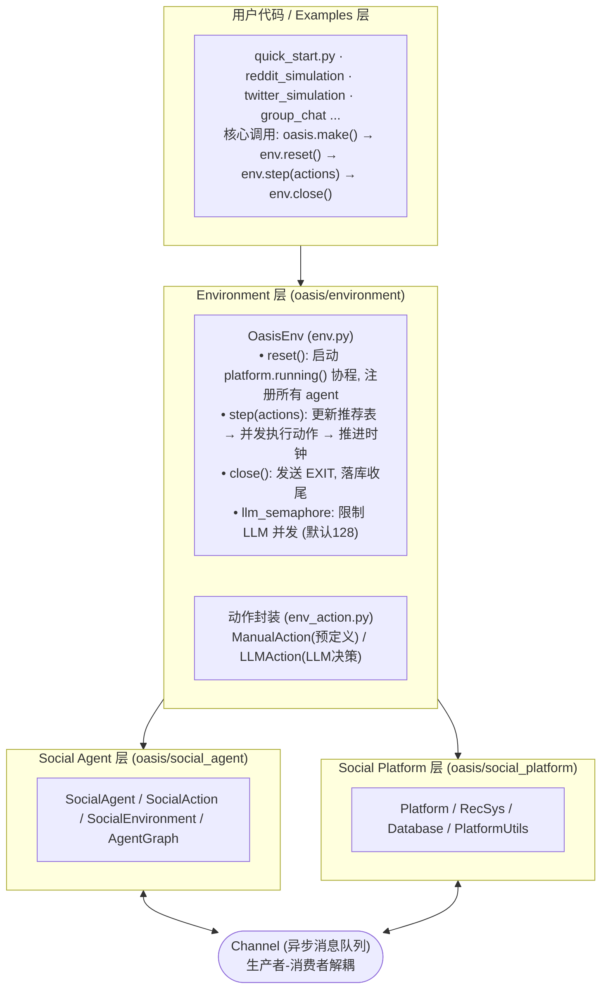
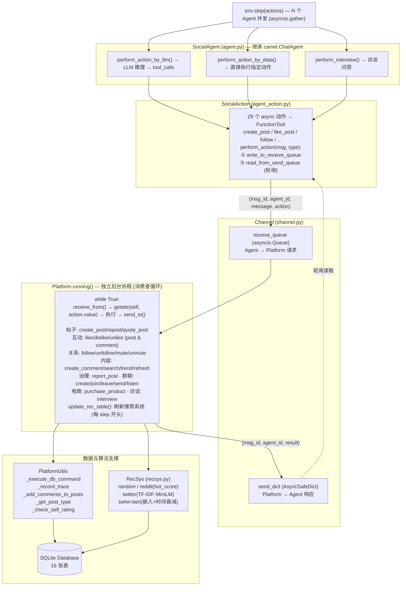
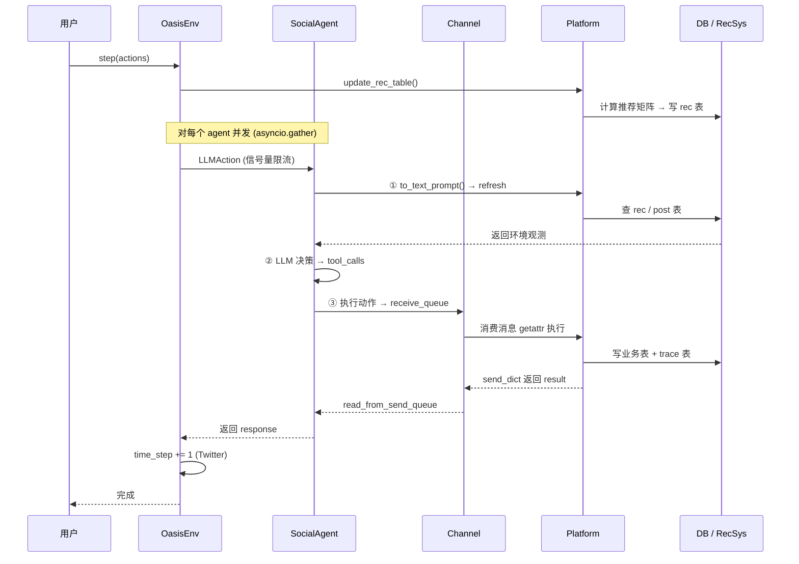
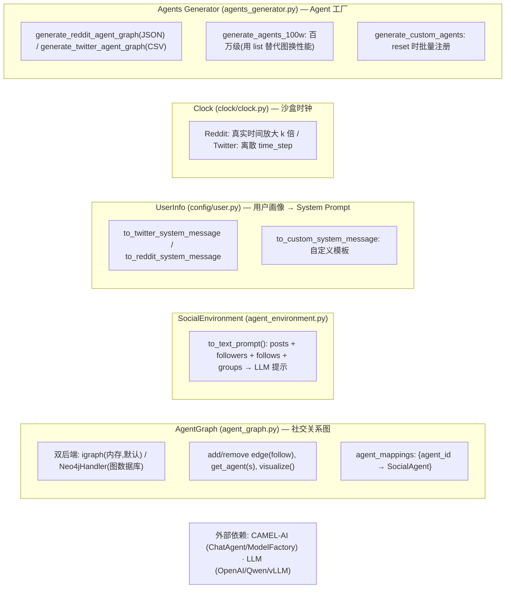
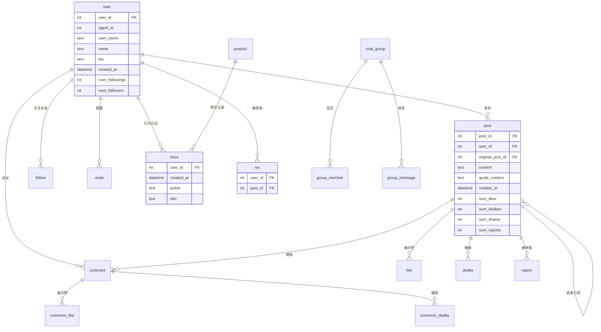

# OASIS 架构文档

> OASIS (Open Agent Social Interaction Simulations) 是一个基于 LLM Agent 的大规模社交媒体模拟器，
> 最高支持百万级 Agent，模拟 Twitter / Reddit 上的用户行为，用于研究信息传播、群体极化、从众行为等社会现象。
>
> 整体采用 **PettingZoo 风格的 Env 接口 + 生产者-消费者异步消息架构**。

---

## 1. 分层总览

---

## 2. 核心运行时架构（双协程 + Channel 解耦）

这是整个系统**最关键的设计**：Agent 与 Platform 通过 `Channel` 异步消息队列完全解耦，
Platform 作为一个独立的后台协程消费消息，串行处理数据库写入，避免 SQLite 并发冲突。

---

## 3. 一次 `env.step()` 的完整数据流（时序图）

---

## 4. 支撑组件

---

## 5. 数据库实体关系 (ER)

> 共 16 张表：`user`, `post`, `comment`, `follow`, `mute`, `like`, `dislike`,
> `comment_like`, `comment_dislike`, `report`, `trace`(行为日志), `rec`(推荐表),
> `product`, `chat_group`, `group_member`, `group_message`。

---

## 6. 关键设计要点

| 设计 | 说明 |
|------|------|
| **生产者-消费者解耦** | Agent 与 Platform 不直接调用，全部经 `Channel` 异步队列；Platform 是单后台协程串行处理 DB 写入，避免 SQLite 并发冲突 |
| **PettingZoo 风格 API** | `make/reset/step/close`，动作以 `dict[Agent → Action]` 传入，对齐多智能体强化学习生态 |
| **两类动作** | `ManualAction`（脚本预设，含 INTERVIEW）/ `LLMAction`（LLM 自主决策，走信号量限流） |
| **动作即工具** | 29 个动作通过 CAMEL `FunctionTool` 暴露给 LLM，`available_actions` 控制每个 Agent 的动作空间 |
| **可插拔推荐系统** | 4 种算法对应 `RecsysType`：random / reddit(热度) / twitter(TF-IDF·MiniLM) / twhin-bert(嵌入)，每步 `step` 前刷新 `rec` 表 |
| **trace 表** | 记录所有 Agent 行为，是事后分析（信息传播、群体极化等）的核心数据 |
| **双图后端** | igraph(内存) 适合常规规模；Neo4j 适合大规模；百万级则退化为 list 以换取性能 |
| **双平台时间模型** | Reddit 用真实时间放大，Twitter 用离散 time_step |

---

## 7. 模块文件索引

| 模块 | 文件 | 职责 |
|------|------|------|
| 入口 | `oasis/__init__.py` | 导出公共 API |
| 环境 | `oasis/environment/env.py` | `OasisEnv` 主循环 (reset/step/close) |
| 环境 | `oasis/environment/env_action.py` | `ManualAction` / `LLMAction` |
| 环境 | `oasis/environment/make.py` | `make()` 工厂 |
| Agent | `oasis/social_agent/agent.py` | `SocialAgent` (继承 ChatAgent) |
| Agent | `oasis/social_agent/agent_action.py` | `SocialAction` (29 个动作工具) |
| Agent | `oasis/social_agent/agent_environment.py` | `SocialEnvironment` (环境观测→提示) |
| Agent | `oasis/social_agent/agent_graph.py` | `AgentGraph` / `Neo4jHandler` |
| Agent | `oasis/social_agent/agents_generator.py` | Agent 工厂函数 |
| 平台 | `oasis/social_platform/platform.py` | `Platform` 业务逻辑 (1642 行) |
| 平台 | `oasis/social_platform/channel.py` | `Channel` 异步消息队列 |
| 平台 | `oasis/social_platform/recsys.py` | 4 种推荐算法 |
| 平台 | `oasis/social_platform/database.py` | SQLite 建库/读写 |
| 平台 | `oasis/social_platform/platform_utils.py` | DB 工具 / trace 记录 |
| 平台 | `oasis/social_platform/typing.py` | `ActionType` / `RecsysType` / `DefaultPlatformType` |
| 平台 | `oasis/social_platform/config/user.py` | `UserInfo` 画像→system prompt |
| 时钟 | `oasis/clock/clock.py` | 沙盒时钟 |
</content>
